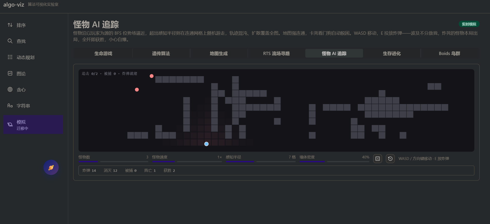

# algo-viz

算法可视化实验室。以「行锚定学习」为核心：源码即播放器的第二时间轴，每一帧对应一行代码。命令流录制与时间轴重放构成骨架，可复现的输入参数、操作统计与不变式说明构成完整的学习闭环。

作者：SantaChains · License：MIT

## 快速开始

```pwsh
bun install
bun run dev      # http://localhost:5173
bun run build    # 类型检查 + 生产构建
bun run lint     # oxlint
```

## 学习方式

- 行锚定：算法代码写裸 `delay()`，构建期插件自动注入行号；播放时源码面板高亮当前执行行，随帧流动，零维护
- 代码旁注：每个算法附 `annotations` 行级中文讲解，与源码并排罗列；点击任意行可 seek 到该行首次执行的步骤
- 双栏布局：左侧可视化 + 统计 + 播放器 + 不变式卡，右侧粘性源码面板，窄屏自动堆叠
- 三段式播放器：播放/暂停、逐步前进与回退、进度拖拽、速度调节，空格与方向键快捷操作
- 可复现输入：mulberry32 种子化 PRNG，排序四分布、图结构按节点数与密度生成、字符串按文本/模式长度生成，同种子同序列
- 参数侧栏：规模、值域、分布、有向性、密度、种子即时调整，重录命令流即时生效
- 命令流统计：步数、比较、写入、入队、发现、回溯等操作计数徽章
- 认知锚点：不变式说明 + 复杂度徽章 + 轻量语法高亮（关键字/字符串/数字/注释）


## 已覆盖算法

| 分类     | 算法                                                                           |
| -------- | ------------------------------------------------------------------------------ |
| 排序     | 冒泡排序、快速排序（Lomuto 分区）                                              |
| 查找     | 二分查找                                                                       |
| 图论     | 深度优先搜索、广度优先搜索、Dijkstra 最短路、A\* 启发式搜索                    |
| 字符串   | KMP（fail 失配表 + 线性扫描）                                                  |
| 动态规划 | 最长上升子序列、编辑距离                                                       |
| 贪心     | 区间调度                                                                       |
| 模拟     | 生命游戏、遗传算法、地图生成、生存进化、RTS 流场寻路、怪物 AI 追踪、Boids 鸟群 |

## 架构

算法代码调用 Tracer API，每个方法调用被序列化为 `key + method + args` 命令流；引擎按 `delay` 切帧形成时间轴；重放时 Viewer 逐命令应用到 Tracer 状态并由渲染器绘制。录制与重放完全解耦，步进回退通过重放前缀实现，无快照开销。

```
plugins/delay-line.ts  # 构建期把裸 delay() 重写为 delay(行号)，跳过字符串与注释
src/
├── core/           # engine（引擎）、tracers（Array1D/Array2D/Graph/Log）、renderers、layouts、random
├── algorithms/     # types（配置契约）、generators（数据/图/字符串生成）、11 个算法 demo
├── sims/           # 7 个交互模拟，独立 rAF 架构（useSimLoop / fitCanvas / 会话统计）
└── components/     # Shell、AlgorithmStage、SimulationStage、SourcePanel、Player、StatsBar、SettingsPanel
```



## 部署

纯静态产物：hash 路由免 404 fallback、源码编译期内联、无运行时网络请求，GitHub Pages / Cloudflare Pages 均可直接托管。子路径经 `BASE_PATH` 环境变量注入构建，本地开发零配置。部署步骤见 [docs/deployment.md](docs/deployment.md)，架构现状与 SQLite 演进路线见 [docs/architecture-roadmap.md](docs/architecture-roadmap.md)。

## 技术栈

Vite 8（Rolldown） · React 19.3 · TypeScript 7（tsgo） · Mantine 9 · Tailwind CSS 4（theme + utilities 层） · SCSS · Bun · oxlint

组件选型规则与样式桥接细节见 [docs/tech-stack.md](docs/tech-stack.md)。

## 未来路线

- 学习方式深化：步骤语义条（把当前帧命令翻译为「比较 a[3] 与 a[4]」式短句）；Chart/Tree 渲染器，解锁计数排序与树结构（Array2D 渲染器与 dp 表格已落地）
- 算法扩充：归并排序、堆排序、插入排序；Kruskal、Prim、拓扑排序；LCS、背包；Trie、Manacher、Rabin-Karp（Dijkstra、A\*、编辑距离已落地）
- 调试界面增强：对比模式（同输入下两种算法并排重放）、断点标记、多帧步骤书签（单帧 cfg 快照分享已落地）
- 工程化：VitePress 文档站、单元测试覆盖 engine 分帧/重放与 delay-line 插件、CI 在现有 build（含 tsc 类型检查）基础上增加 lint + test 门禁

## 致谢

架构与交互设计参考了两个优秀的开源可视化项目：

- [algorithm-visualizer](https://github.com/algorithm-visualizer/algorithm-visualizer)：命令流录制、`delay()` 分帧、时间轴重放的三段式架构来源
- [Algorithm-Visualizer](https://github.com/aoright/Algorithm-Visualizer)：分类组织与页面表达方式来源

感谢上述项目的作者与各技术栈社区的贡献。

## 许可

[MIT](LICENSE) © SantaChains
